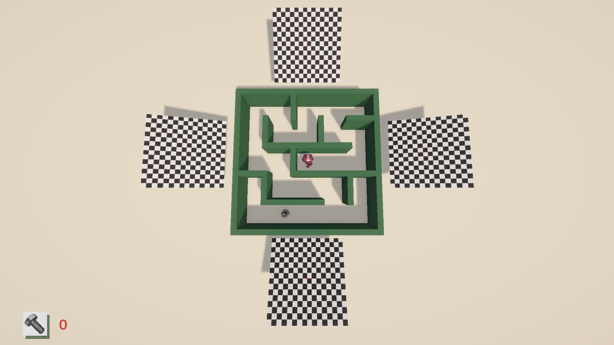
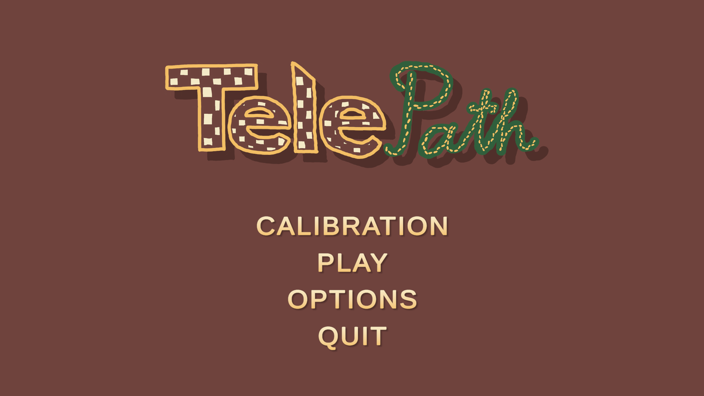
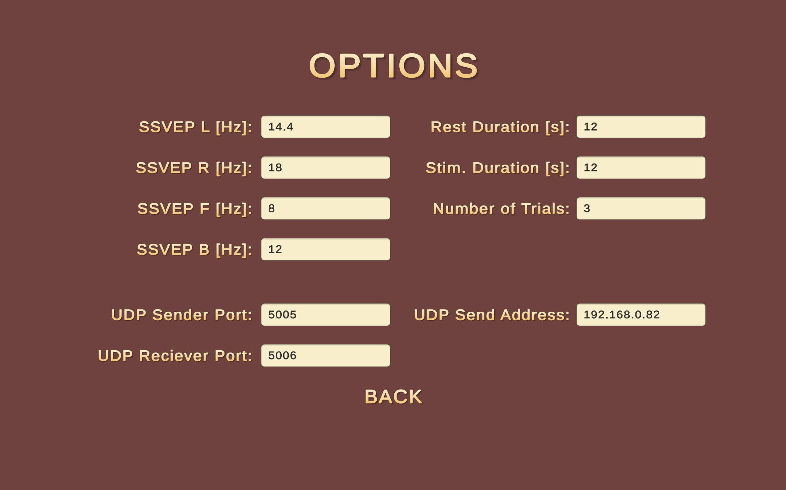
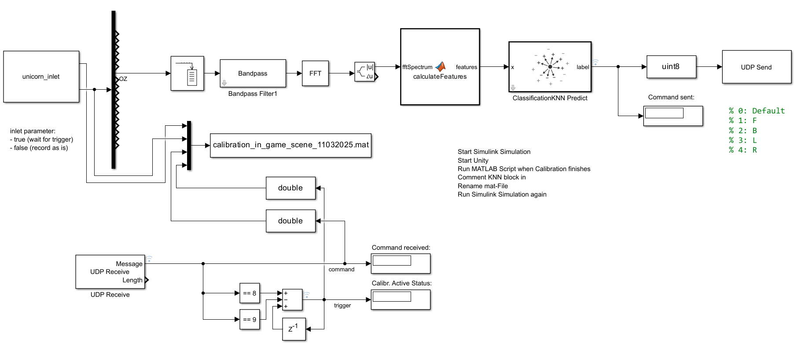
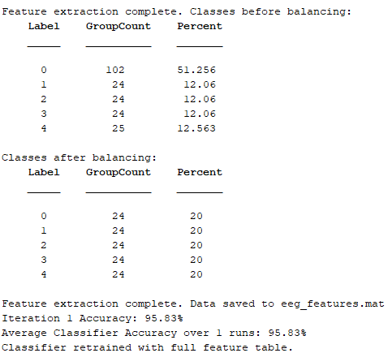
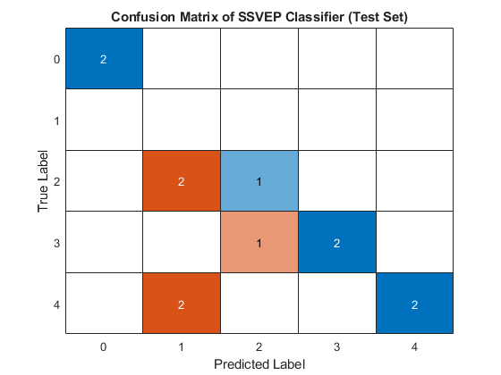
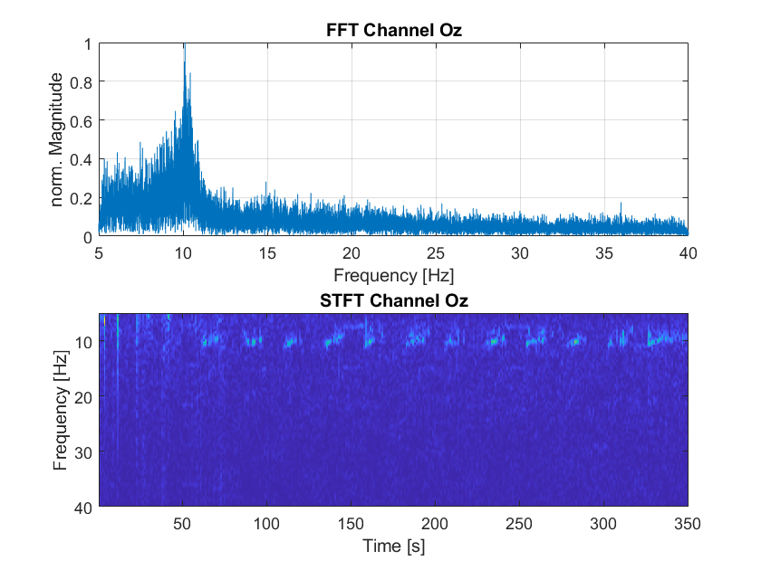
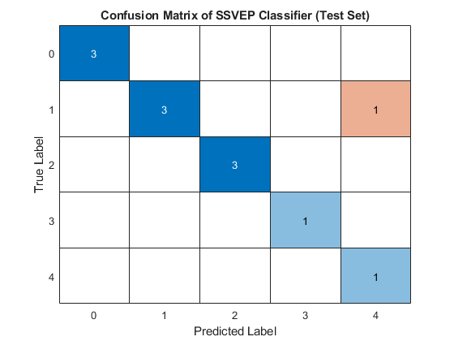

# SSVEP-Controlled VR Maze Navigation Using EEG and Unity

This project presents a Unity-based virtual reality (VR) maze navigation game controlled entirely through a Steady-State Visual Evoked Potential (SSVEP)-based Brain-Computer Interface (BCI). It was developed as part of the Neural Engineering Master's programme at Saarland University of Applied Sciences.

## Project Overview

The objective is to enable users to control in-game movement using EEG signals recorded with the g.tec Unicorn Hybrid Black system. Visual stimuli at defined frequencies are displayed in VR, and the user’s focus on these stimuli modulates brain activity in the occipital lobe. These signals are processed in real time using MATLAB/Simulink and classified using a K-Nearest Neighbors (KNN) model. Movement commands are sent to the Unity environment via UDP.

The game, built in Unity 6 with Universal Render Pipeline (URP), is compatible with the Meta Quest II VR headset and includes a main menu, calibration module, and procedurally generated maze gameplay.

---

## Key Features

### EEG-Controlled VR Game

The user navigates the robot character “Jammo” through a maze using SSVEPs corresponding to 8 Hz (up), 12 Hz (down), 14.4 Hz (left), and 18 Hz (right). Each frequency is represented by a checkerboard flickering stimulus placed on the maze walls.

**Game Layout with Stimuli:**

---

### Menu System and Configuration

Unity includes a fully interactive main menu and an options interface to dynamically configure calibration and stimulation parameters, including stimulus frequencies, trial durations, and UDP port settings.

**Main Menu:**  

**Options Menu:**  

---

### EEG Processing Pipeline

EEG is recorded via Bluetooth from channel Oz, then filtered, segmented, and transformed via FFT in Simulink. A total of 13 features are extracted from the frequency domain, including harmonics and cross-feature ratios. These are passed to a trained KNN model for classification.

**Simulink Real-Time Classification Pipeline:**

---

### Calibration and Feature Training

During calibration, 12 stimulus trials are recorded and labeled in real-time via UDP. Features are extracted offline in MATLAB and the classifier is trained and exported to Simulink.

**Class Balance After Preprocessing:**

**Confusion Matrix (Subject 1):**

---

## Evaluation and Results

### Performance Summary

- **VR Accuracy:** 58–66% (2 participants)
- **Non-VR Accuracy:** Up to 91% (same participant)
- **User Experience:** Participants reported high engagement but reduced control accuracy in VR

**FFT and STFT – VR Measurement:**

**Confusion Matrix – Non-VR:**

---

## Limitations

- Frame rate instability in Unity caused SSVEP frequency misalignment
- Lack of impedance monitoring due to hardware constraints
- EEG noise from VR headset proximity and physical strain
- Simulink model must be restarted manually to load trained classifier

---

## Future Work

- Automatic real-time calibration and classifier training
- Integration of lightweight EEG caps and dry electrodes
- Hardware-based external stimulus synchronization
- Adaptive frequency bin adjustment based on user response

---

## Repository Contents

- `Assets/` – Unity game assets
- `Packages/` – Unity package manifest
- `ProjectSettings/` – Unity project settings
- `UserSettings/` – Optional Unity IDE settings
- `README.md` – This document
- `.gitignore` – Unity + Visual Studio exclusions

> Note: `Library/`, `Logs/`, `obj/`, `.vs/`, and generated files are excluded via `.gitignore`.

---

## Simulink Availability

The full Simulink model and MATLAB feature extraction scripts can be made available upon request. Due to licensing constraints, the **g.tec Unicorn Simulink block is not included** and must be sourced through g.tec’s official channels.

---

## License

© 2025 Hristo Marinov  
This work is licensed under the [CC BY-NC-ND 4.0 License](http://creativecommons.org/licenses/by-nc-nd/4.0/).  
Commercial use or derivative works require prior written consent.

---

## Contact

[Hristo Marinov](https://www.linkedin.com/in/hmarinov/)

---
